# Communication Between Control Unit, Data Loader, and AGU

This document provides a detailed explanation of the signal communication between the **Control Unit (CU)**, **Address Generation Unit (AGU)**, and **Data Loader** in the VLSI Convolution Accelerator.

---

## 📊 System Overview

The **Control Unit** acts as the central orchestrator (FSM) that coordinates both the **Data Loader** and the **Address Generation Unit (AGU)**. The Data Loader and AGU work together to handle memory operations.

```mermaid
graph TB
    subgraph Control["Control Unit (Main FSM)"]
        FSM["State Machine<br/>IDLE→LOAD_WEIGHTS→LOAD_INPUT→COMPUTE→DRAIN→DONE"]
    end

    subgraph DataPath["Data Path"]
        AGU["Address Generation<br/>Unit (AGU)"]
        DL["Data Loader"]
    end

    FSM -->|"agu_enable, agu_mode, agu_start"| AGU
    AGU -->|"agu_done"| FSM
    FSM -->|"mem_write_en, mem_read_en, bank_sel"| DL
    AGU -->|"read/write addresses"| DL
```



---

## 🔌 Signal Interface: Control Unit → AGU

| Signal        | Width  | Direction | Description                                                           |
| ------------- | ------ | --------- | --------------------------------------------------------------------- |
| `agu_enable`  | 1-bit  | CU → AGU  | **Master enable** for the AGU, activates address generation when high |
| `agu_mode`    | 3-bit  | CU → AGU  | **Operation mode** that determines the address pattern to generate    |
| `agu_start`   | 1-bit  | CU → AGU  | **Pulse signal** to trigger the start of a new AGU operation          |
| `latched_N`   | 7-bit  | CU → AGU  | Latched input matrix dimension (N)                                    |
| `latched_K`   | 5-bit  | CU → AGU  | Latched kernel dimension (K)                                          |
| `output_size` | 12-bit | CU → AGU  | Total output elements: (N-K+1)²                                       |

### AGU Mode Encoding

| Mode Value | Name                   | Description                                     |
| ---------- | ---------------------- | ----------------------------------------------- |
| `3'b000`   | `AGU_MODE_IDLE`        | No operation                                    |
| `3'b001`   | `AGU_MODE_LOAD_WEIGHT` | Linear/sequential addresses for weight loading  |
| `3'b010`   | `AGU_MODE_LOAD_INPUT`  | Linear/sequential addresses for input loading   |
| `3'b011`   | `AGU_MODE_SLIDING_WIN` | Sliding window pattern for convolution          |
| `3'b100`   | `AGU_MODE_UNLOAD`      | Linear/sequential addresses for output draining |

---

## 🔌 Signal Interface: AGU → Control Unit

| Signal     | Width | Direction | Description                                                              |
| ---------- | ----- | --------- | ------------------------------------------------------------------------ |
| `agu_done` | 1-bit | AGU → CU  | Asserted when the AGU completes its current address generation operation |

---

## 🔌 Signal Interface: Control Unit → Data Loader

| Signal            | Width | Direction | Description                                             |
| ----------------- | ----- | --------- | ------------------------------------------------------- |
| `mem_write_en`    | 1-bit | CU → DL   | **Write enable** - activates memory write operations    |
| `mem_read_en`     | 1-bit | CU → DL   | **Read enable** - activates memory read operations      |
| `bank_sel`        | 1-bit | CU → DL   | **Ping-pong bank select** (0 or 1) for double buffering |
| `weight_bank_sel` | 1-bit | CU → DL   | **Weight bank select** for weight memory                |

---

## 🔌 Signal Interface: AGU → Data Loader

| Signal       | Width   | Direction | Description                      |
| ------------ | ------- | --------- | -------------------------------- |
| `read_addr`  | ~12-bit | AGU → DL  | Generated read address for SRAM  |
| `write_addr` | ~12-bit | AGU → DL  | Generated write address for SRAM |

---

## 🔌 External Data Stream Interface

These signals handle communication with external DRAM. **All data signals go through the Data Loader**, while the **Control Unit** only receives status/control signals:

### Data Loader ↔ External DRAM

| Signal     | Width    | Direction     | Description                       |
| ---------- | -------- | ------------- | --------------------------------- |
| `rx_data`  | 8-32 bit | External → DL | Incoming data stream from DRAM    |
| `rx_valid` | 1-bit    | External → DL | DRAM has valid data to send       |
| `rx_ready` | 1-bit    | DL → External | Data Loader ready to accept data  |
| `tx_data`  | 8-32 bit | DL → External | Outgoing data stream to DRAM      |
| `tx_valid` | 1-bit    | DL → External | Data Loader has valid result      |
| `tx_ready` | 1-bit    | External → DL | DRAM ready to accept results      |

### Data Loader → Control Unit (Status)

| Signal       | Width | Direction | Description                              |
| ------------ | ----- | --------- | ---------------------------------------- |
| `load_done`  | 1-bit | DL → CU   | Loading operation complete               |
| `drain_done` | 1-bit | DL → CU   | Drain operation complete                 |

> [!NOTE]
> The Control Unit does NOT directly interface with DRAM. All data handshaking is managed by the Data Loader. CU only receives completion status signals.

---

## 📈 State-by-State Signal Behavior

### IDLE State

| Signal         | Value  | Notes               |
| -------------- | ------ | ------------------- |
| `agu_enable`   | 0      | AGU disabled        |
| `agu_mode`     | `IDLE` | No operation mode   |
| `mem_write_en` | 0      | No memory writes    |
| `mem_read_en`  | 0      | No memory reads     |
| `rx_ready`     | 0      | Not accepting data  |
| `tx_valid`     | 0      | No output available |

### LOAD_WEIGHTS State

| Signal            | Value         | Notes                    |
| ----------------- | ------------- | ------------------------ |
| `agu_enable`      | 1             | AGU enabled              |
| `agu_mode`        | `LOAD_WEIGHT` | Linear write pattern     |
| `agu_start`       | 1 (pulse)     | Pulse on state entry     |
| `mem_write_en`    | `rx_valid`    | Write when data valid    |
| `weight_bank_sel` | 0             | Write to weight bank 0   |
| `rx_ready`        | 1             | Ready to receive weights |

### LOAD_INPUT State

| Signal         | Value        | Notes                  |
| -------------- | ------------ | ---------------------- |
| `agu_enable`   | 1            | AGU enabled            |
| `agu_mode`     | `LOAD_INPUT` | Linear write pattern   |
| `agu_start`    | 1 (pulse)    | Pulse for new tile     |
| `mem_write_en` | `rx_valid`   | Write when data valid  |
| `bank_sel`     | toggle       | Ping-pong buffering    |
| `rx_ready`     | 1            | Ready to receive input |

### COMPUTE State

| Signal         | Value         | Notes                  |
| -------------- | ------------- | ---------------------- |
| `agu_enable`   | 1             | AGU enabled            |
| `agu_mode`     | `SLIDING_WIN` | Sliding window pattern |
| `agu_start`    | 1             | Continuous starts      |
| `mem_write_en` | 0             | No writes              |
| `mem_read_en`  | 1             | Reading operands       |
| `rx_ready`     | 0             | Not accepting data     |

### DRAIN State

| Signal        | Value    | Notes               |
| ------------- | -------- | ------------------- |
| `agu_enable`  | 1        | AGU enabled         |
| `agu_mode`    | `UNLOAD` | Linear read pattern |
| `mem_read_en` | 1        | Reading results     |
| `tx_valid`    | 1        | Output available    |

### DONE State

| Signal       | Value  | Notes                     |
| ------------ | ------ | ------------------------- |
| `agu_enable` | 0      | AGU disabled              |
| `agu_mode`   | `IDLE` | No operation              |
| `done`       | 1      | Signal completion to host |

---

## 🔄 Complete Signal Flow Diagram

```
┌─────────────────────────────────────────────────────────────────────────┐
│                          CONTROL UNIT (FSM)                             │
├─────────────────────────────────────────────────────────────────────────┤
│                                                                         │
│   Inputs:                          Outputs:                             │
│   ├─ clk                           ├─→ agu_enable ──────────→ AGU       │
│   ├─ rst_n                         ├─→ agu_mode[2:0] ──────→ AGU       │
│   ├─ start ←─── Host               ├─→ agu_start ──────────→ AGU       │
│   ├─ cfg_N[6:0] ←─── Host          │                                   │
│   ├─ cfg_K[4:0] ←─── Host          ├─→ mem_write_en ───────→ Data Loader│
│   │                                ├─→ mem_read_en ────────→ Data Loader│
│   ├─ rx_valid ←─── DRAM            ├─→ bank_sel ───────────→ Data Loader│
│   ├─ tx_ready ←─── DRAM            ├─→ weight_bank_sel ────→ Data Loader│
│   │                                │                                   │
│   ├─ agu_done ←─── AGU             ├─→ rx_ready ───────────→ DRAM      │
│   ├─ sa_done ←─── Systolic Array   ├─→ tx_valid ───────────→ DRAM      │
│   │                                ├─→ done ───────────────→ Host      │
│   │                                │                                   │
│   │                                ├─→ latched_N[6:0] ─────→ AGU       │
│   │                                ├─→ latched_K[4:0] ─────→ AGU       │
│   │                                └─→ output_size[11:0] ──→ AGU       │
│                                                                         │
└─────────────────────────────────────────────────────────────────────────┘

┌─────────────────────────────────┐    ┌─────────────────────────────────┐
│             AGU                 │    │         DATA LOADER             │
├─────────────────────────────────┤    ├─────────────────────────────────┤
│ Inputs:                         │    │ Inputs:                         │
│ ├─ agu_enable ←── CU            │    │ ├─ mem_write_en ←── CU          │
│ ├─ agu_mode[2:0] ←── CU         │    │ ├─ mem_read_en ←── CU           │
│ ├─ agu_start ←── CU             │    │ ├─ bank_sel ←── CU              │
│ ├─ latched_N ←── CU             │    │ ├─ weight_bank_sel ←── CU       │
│ ├─ latched_K ←── CU             │    │ ├─ rx_data ←── DRAM             │
│                                 │    │ ├─ addr ←── AGU                 │
│ Outputs:                        │    │                                 │
│ ├─→ agu_done ──→ CU             │    │ Outputs:                        │
│ ├─→ read_addr ──→ Data Loader   │    │ ├─→ tx_data ──→ DRAM            │
│ ├─→ write_addr ──→ Data Loader  │    │ ├─→ data_out ──→ Systolic Array │
│                                 │    │                                 │
└─────────────────────────────────┘    └─────────────────────────────────┘
```

---

## 📋 Summary Table: All Signals Between Components

| From    | To              | Signal            | Width | Purpose                       |
| ------- | --------------- | ----------------- | ----- | ----------------------------- |
| **CU**  | **AGU**         | `agu_enable`      | 1     | Enable/disable AGU            |
| **CU**  | **AGU**         | `agu_mode`        | 3     | Operation mode (0-4)          |
| **CU**  | **AGU**         | `agu_start`       | 1     | Start pulse for new operation |
| **CU**  | **AGU**         | `latched_N`       | 7     | Input matrix dimension        |
| **CU**  | **AGU**         | `latched_K`       | 5     | Kernel dimension              |
| **CU**  | **AGU**         | `output_size`     | 12    | Total output elements         |
| **AGU** | **CU**          | `agu_done`        | 1     | Operation complete flag       |
| **CU**  | **Data Loader** | `mem_write_en`    | 1     | Memory write enable           |
| **CU**  | **Data Loader** | `mem_read_en`     | 1     | Memory read enable            |
| **CU**  | **Data Loader** | `bank_sel`        | 1     | Ping-pong bank select         |
| **CU**  | **Data Loader** | `weight_bank_sel` | 1     | Weight bank select            |
| **AGU** | **Data Loader** | `read_addr`       | ~12   | Generated read address        |
| **AGU** | **Data Loader** | `write_addr`      | ~12   | Generated write address       |

---

## 📖 Detailed Signal Explanations

This section provides in-depth explanations for every signal in the system.

### Control Unit → AGU Signals

#### `agu_enable` (1-bit)

**Purpose:** Master on/off switch for the Address Generation Unit.

When this signal is **HIGH (1)**, the AGU is powered on and actively generating addresses based on its current mode. When **LOW (0)**, the AGU is completely disabled and holds its outputs in a reset state. This signal is used to save power during idle periods and to ensure the AGU doesn't produce spurious addresses when not needed.

**Behavior:**

- Set to `1` during LOAD_WEIGHTS, LOAD_INPUT, COMPUTE, and DRAIN states
- Set to `0` during IDLE and DONE states

---

#### `agu_mode` (3-bit)

**Purpose:** Tells the AGU which address generation pattern to use.

This signal selects one of five address generation algorithms inside the AGU. Each mode produces a different sequence of addresses optimized for a specific memory access pattern:

| Value    | Mode                   | Address Pattern                                                                                                                                 |
| -------- | ---------------------- | ----------------------------------------------------------------------------------------------------------------------------------------------- |
| `3'b000` | `AGU_MODE_IDLE`        | No addresses generated; outputs held at zero                                                                                                    |
| `3'b001` | `AGU_MODE_LOAD_WEIGHT` | **Linear sequential:** Generates addresses 0, 1, 2, 3, ... for loading K×K weight values contiguously into weight SRAM                          |
| `3'b010` | `AGU_MODE_LOAD_INPUT`  | **Linear sequential:** Generates addresses 0, 1, 2, ... for loading N×N input tile values contiguously into input SRAM                          |
| `3'b011` | `AGU_MODE_SLIDING_WIN` | **Sliding window:** Generates K×K addresses per output pixel, sliding across the input matrix with proper row/column offsets for 2D convolution |
| `3'b100` | `AGU_MODE_UNLOAD`      | **Linear sequential:** Generates addresses 0, 1, 2, ... for reading (N-K+1)² output results from output SRAM                                    |

**Why sliding window is special:** In convolution, each output pixel requires reading a K×K window from the input. The window slides one position at a time. The AGU in `SLIDING_WIN` mode automatically calculates which K×K input addresses correspond to each output position.

---

#### `agu_start` (1-bit)

**Purpose:** Pulse signal that triggers the AGU to begin a new address generation sequence.

When this signal pulses **HIGH for one clock cycle**, the AGU:

1. Resets its internal address counters to zero
2. Begins generating addresses according to the current `agu_mode`
3. Continues until it reaches the end of the sequence (then asserts `agu_done`)

**Important:** This is a **pulse**, not a level signal. The Control Unit asserts it for exactly one cycle at the start of each phase.

---

#### `latched_N` (7-bit)

**Purpose:** Provides the input matrix dimension (N) to the AGU for address calculations.

The AGU needs to know the input matrix size (N×N) to correctly calculate:

- How many input addresses to generate during LOAD_INPUT (N² addresses)
- Row boundaries for sliding window calculations (address = row × N + column)
- When to wrap to the next row during convolution

**Range:** 1 to 127 (7-bit unsigned), but practically limited by SRAM size.

---

#### `latched_K` (5-bit)

**Purpose:** Provides the kernel/filter dimension (K) to the AGU for address calculations.

The AGU needs to know the kernel size (K×K) to correctly calculate:

- How many weight addresses to generate during LOAD_WEIGHT (K² addresses)
- How many addresses comprise one "window" during sliding window mode
- The output feature map size: (N-K+1)×(N-K+1)

**Range:** 1 to 31 (5-bit unsigned), but typically 1, 3, 5, or 7 for common convolution kernels.

---

#### `output_size` (12-bit)

**Purpose:** Pre-calculated total number of output elements: (N-K+1)².

The Control Unit calculates this value and provides it to the AGU so it knows:

- How many output pixels to generate addresses for during COMPUTE
- How many results to drain during UNLOAD
- When to assert `agu_done` at end of operation

**Why pre-calculated:** Computing (N-K+1)² requires a subtraction and multiplication—providing it pre-calculated simplifies AGU hardware.

---

### AGU → Control Unit Signals

#### `agu_done` (1-bit)

**Purpose:** Handshake signal indicating the AGU has completed its current operation.

When the AGU finishes generating all addresses for the current mode (e.g., all K² weight addresses, or all output_size sliding windows), it asserts `agu_done` **HIGH**. The Control Unit uses this to:

1. Know when to transition to the next FSM state
2. Avoid moving on before data loading/computation is complete

**Behavior:**

- Stays **LOW (0)** while AGU is actively generating addresses
- Goes **HIGH (1)** for one cycle when the last address is generated
- Returns to **LOW** when `agu_start` pulses again for a new operation

---

### Control Unit → Data Loader Signals

#### `mem_write_en` (1-bit)

**Purpose:** Enables write operations to the SRAM memory.

When **HIGH (1)**, the Data Loader writes incoming data (`rx_data`) to the SRAM at the address provided by the AGU (`write_addr`). When **LOW (0)**, no writes occur regardless of other signals.

**Usage pattern:**

- Set to `rx_valid` during LOAD_WEIGHTS and LOAD_INPUT (write only when valid data arrives)
- Set to `0` during COMPUTE and DRAIN (read-only operations)

---

#### `mem_read_en` (1-bit)

**Purpose:** Enables read operations from the SRAM memory.

When **HIGH (1)**, the Data Loader reads data from the SRAM at the address provided by the AGU (`read_addr`) and outputs it. When **LOW (0)**, no reads occur.

**Usage pattern:**

- Set to `1` during COMPUTE (reading operands for systolic array)
- Set to `1` during DRAIN (reading results to send out)
- Set to `0` during LOAD states (write-only operations)

---

#### `bank_sel` (1-bit)

**Purpose:** Selects which ping-pong buffer bank to use for input data.

The accelerator uses **double buffering (ping-pong)** for input data:

- While one bank is being read for computation, the other can be loaded with the next input tile
- This hides memory latency and improves throughput

| Value | Selected Bank |
| ----- | ------------- |
| `0`   | Bank A        |
| `1`   | Bank B        |

**Toggling:** The Control Unit toggles this signal between tiles to alternate banks.

---

#### `weight_bank_sel` (1-bit)

**Purpose:** Selects which weight memory bank to use.

Similar to `bank_sel`, but for weight memory. This allows:

- Pre-loading next layer's weights while current layer computes
- Supporting different weight sets for multi-kernel operations

**Typically:** Set to `0` for single-kernel operations.

---

### AGU → Data Loader Signals

#### `read_addr` (~12-bit)

**Purpose:** Specifies which SRAM address to read from.

This is the address output from the AGU that tells the Data Loader where in SRAM to fetch data. The width (~12 bits) is determined by SRAM size:

- 12 bits can address up to 4096 locations
- Actual width depends on the configured SRAM depth

**Generated patterns:**

- **LOAD states:** Not used (write addresses active instead)
- **COMPUTE state:** K×K addresses per output pixel in sliding window pattern
- **DRAIN state:** Sequential 0, 1, 2, ... up to output_size

---

#### `write_addr` (~12-bit)

**Purpose:** Specifies which SRAM address to write to.

This is the address output from the AGU that tells the Data Loader where in SRAM to store incoming data.

**Generated patterns:**

- **LOAD_WEIGHTS:** Sequential 0, 1, 2, ... up to K²-1
- **LOAD_INPUT:** Sequential 0, 1, 2, ... up to N²-1
- **COMPUTE/DRAIN states:** Not used (read addresses active instead)

---

### External Data Stream Signals (AXI-Stream Style)

#### `rx_data` (8-32 bit)

**Purpose:** Incoming data bus carrying weights or input values from external DRAM.

This is the actual data payload coming into the accelerator. Width is configurable:

- 8-bit: One value per transfer (simple, slower)
- 16-bit: Two values per transfer
- 32-bit: Four 8-bit values per transfer (faster, more complex)

**Data format:** Typically 8-bit fixed-point or integer values for weights and activations.

---

#### `rx_valid` (1-bit)

**Purpose:** Indicates that valid data is present on `rx_data`.

This is part of the **ready/valid handshake** protocol:

- When **HIGH (1)**: DRAM controller has valid data on `rx_data`
- When **LOW (0)**: No valid data; `rx_data` contents are undefined

**Critical rule:** Data transfers ONLY when BOTH `rx_valid=1` AND `rx_ready=1`.

---

#### `rx_ready` (1-bit)

**Purpose:** Indicates that the accelerator is ready to accept incoming data.

This is the accelerator's side of the handshake:

- When **HIGH (1)**: Accelerator can accept data (has SRAM space, in correct state)
- When **LOW (0)**: Accelerator is busy and cannot accept data

**Set by Control Unit:**

- `1` during LOAD_WEIGHTS and LOAD_INPUT states
- `0` during COMPUTATE, DRAIN, IDLE, DONE states

---

#### `tx_data` (8-32 bit)

**Purpose:** Outgoing data bus carrying computed results to external DRAM.

This carries the convolution output values from the accelerator back to DRAM. Width matches `rx_data` for consistent bus architecture.

---

#### `tx_valid` (1-bit)

**Purpose:** Indicates that the accelerator has valid result data available on `tx_data`.

When **HIGH (1)**: Accelerator is outputting valid result data
When **LOW (0)**: No valid output (still computing or idle)

**Set by Control Unit:**

- `1` during DRAIN state when results are being read out
- `0` otherwise

---

#### `tx_ready` (1-bit)

**Purpose:** Indicates that external DRAM is ready to accept output data.

This is the DRAM controller's side of the output handshake:

- When **HIGH (1)**: DRAM can accept result data
- When **LOW (0)**: DRAM is busy (e.g., buffer full)

**Backpressure:** If `tx_ready=0`, the accelerator must pause draining until DRAM is ready.

---

### Other Control Signals

#### `start` (1-bit, Host → CU)

**Purpose:** Initiates a new convolution operation.

When the host pulses this signal, the Control Unit:

1. Latches the configuration values (`cfg_N`, `cfg_K`)
2. Transitions from IDLE to LOAD_WEIGHTS state
3. Begins the full convolution sequence

---

#### `done` (1-bit, CU → Host)

**Purpose:** Signals that the convolution operation is complete.

Asserted **HIGH** when the Control Unit enters the DONE state, indicating:

- All results have been drained to DRAM
- The accelerator is ready for a new operation
- The host can read results from DRAM

---

#### `sa_done` (1-bit, Systolic Array → CU)

**Purpose:** Indicates the systolic array has finished all MAC operations.

The systolic array takes multiple cycles to complete computation. When it asserts `sa_done`:

- All output pixels have been computed
- Results are ready in output SRAM
- Control Unit can transition to DRAIN state

---

## 🔄 Sequence Diagram: Complete Operation Flow


---

> [!NOTE]
> The AGU generates addresses based on the current mode set by the Control Unit. The Data Loader uses these addresses along with the read/write enables from the Control Unit to perform actual memory operations.

> [!IMPORTANT]
> The handshake between `rx_valid`/`rx_ready` and `tx_valid`/`tx_ready` follows the AXI-Stream protocol: data transfers ONLY when BOTH valid AND ready are HIGH.