# Communication Between Control Unit and Systolic Array

This document provides a detailed explanation of the signal communication between the **Control Unit (CU)** and the **Systolic Array (SA)** in the VLSI Convolution Accelerator.

---

## 📊 System Overview

The **Systolic Array** is the computational heart of the accelerator, performing Multiply-Accumulate (MAC) operations. The **Control Unit** orchestrates when the array operates, while the **Data Loader** feeds operands to the array.

```mermaid
graph TB
    subgraph Control["Control Unit (Main FSM)"]
        FSM["State Machine<br/>IDLE→LOAD_WEIGHTS→LOAD_INPUT→COMPUTE→DRAIN→DONE"]
    end

    subgraph Compute["Compute Core"]
        SA["Systolic Array<br/>(8×8 PEs)"]
    end

    subgraph Memory["Memory"]
        DL["Data Loader"]
    end

    FSM -->|"sa_enable, sa_clear, weight_load_en"| SA
    SA -->|"sa_done"| FSM
    DL -->|"pixel_data, weight_data"| SA
    SA -->|"result_data"| DL
```



---

## 🔌 Signal Interface: Control Unit → Systolic Array

| Signal          | Width | Direction | Description                                                  |
| --------------- | ----- | --------- | ------------------------------------------------------------ |
| `sa_enable`     | 1-bit | CU → SA   | **Master enable** - activates the systolic array computation |
| `sa_clear`      | 1-bit | CU → SA   | **Clear/reset** - resets all partial sum accumulators to 0   |
| `weight_load_en`| 1-bit | CU → SA   | **Weight load enable** - allows weights to be loaded into PEs|
| `tile_start`    | 1-bit | CU → SA   | **Tile start pulse** - signals start of a new kernel tile    |
| `last_tile`     | 1-bit | CU → SA   | **Last tile flag** - indicates this is the final tile (results are final) |

---

## 🔌 Signal Interface: Systolic Array → Control Unit

| Signal      | Width | Direction | Description                                                  |
| ----------- | ----- | --------- | ------------------------------------------------------------ |
| `tile_done` | 1-bit | SA → CU   | Asserted when current tile's MAC operations are complete     |
| `sa_done`   | 1-bit | SA → CU   | Asserted when ALL tiles complete (final results ready)       |

---

## 🔌 Signal Interface: Data Loader → Systolic Array

| Signal        | Width          | Direction | Description                                      |
| ------------- | -------------- | --------- | ------------------------------------------------ |
| `pixel_data`  | 8-bit × 8 rows | DL → SA   | Input pixel values fed to each row (West input)  |
| `weight_data` | 8-bit × K²     | DL → SA   | Weight values loaded into PEs (during load phase)|
| `pixel_valid` | 1-bit          | DL → SA   | Indicates valid pixel data on the bus            |

---

## 🔌 Signal Interface: Systolic Array → Data Loader

| Signal        | Width          | Direction | Description                                          |
| ------------- | -------------- | --------- | ---------------------------------------------------- |
| `result_data` | 32-bit × 8 cols| SA → DL   | Accumulated output results (South output of last row)|
| `result_valid`| 1-bit          | SA → DL   | Indicates valid result data available                |

---

## 📈 State-by-State Signal Behavior

### IDLE State

| Signal          | Value | Notes                          |
| --------------- | ----- | ------------------------------ |
| `sa_enable`     | 0     | Systolic array disabled        |
| `sa_clear`      | 0     | No clearing (already idle)     |
| `weight_load_en`| 0     | Not loading weights            |

### LOAD_WEIGHTS State

| Signal          | Value | Notes                              |
| --------------- | ----- | ---------------------------------- |
| `sa_enable`     | 0     | Computation not started yet        |
| `sa_clear`      | 1     | Clear accumulators for fresh start |
| `weight_load_en`| 1     | Loading weights into PE registers  |

### LOAD_INPUT State

| Signal          | Value | Notes                          |
| --------------- | ----- | ------------------------------ |
| `sa_enable`     | 0     | Still loading, not computing   |
| `sa_clear`      | 0     | Weights loaded, don't clear    |
| `weight_load_en`| 0     | Weights already loaded         |

### COMPUTE State

| Signal          | Value | Notes                                    |
| --------------- | ----- | ---------------------------------------- |
| `sa_enable`     | 1     | **Active computation** - MAC operations  |
| `sa_clear`      | 0     | Accumulating partial sums                |
| `weight_load_en`| 0     | Weights are stationary (already in PEs)  |

### DRAIN State

| Signal          | Value | Notes                          |
| --------------- | ----- | ------------------------------ |
| `sa_enable`     | 0     | Computation complete           |
| `sa_clear`      | 0     | Results being read out         |
| `weight_load_en`| 0     | No weight operations           |

### DONE State

| Signal          | Value | Notes                          |
| --------------- | ----- | ------------------------------ |
| `sa_enable`     | 0     | Systolic array idle            |
| `sa_clear`      | 1     | Prepare for next operation     |
| `weight_load_en`| 0     | No weight operations           |

---

## 🔄 Signal Flow Diagram

```
┌─────────────────────────────────────────────────────────────────────────┐
│                          CONTROL UNIT (FSM)                             │
├─────────────────────────────────────────────────────────────────────────┤
│                                                                         │
│   Inputs:                          Outputs:                             │
│   ├─ clk                           ├─→ sa_enable ──────────→ SA        │
│   ├─ rst_n                         ├─→ sa_clear ───────────→ SA        │
│   ├─ start ←─── Host               ├─→ weight_load_en ─────→ SA        │
│   │                                │                                   │
│   ├─ sa_done ←─── Systolic Array   │                                   │
│   │                                │                                   │
└─────────────────────────────────────────────────────────────────────────┘

┌─────────────────────────────────────────────────────────────────────────┐
│                          SYSTOLIC ARRAY (8×8)                           │
├─────────────────────────────────────────────────────────────────────────┤
│                                                                         │
│   From Control Unit:               From Data Loader:                    │
│   ├─ sa_enable                     ├─ pixel_data[7:0] × 8 rows         │
│   ├─ sa_clear                      ├─ weight_data[7:0] × K²            │
│   ├─ weight_load_en                ├─ pixel_valid                      │
│                                                                         │
│   To Control Unit:                 To Data Loader:                      │
│   ├─→ sa_done                      ├─→ result_data[31:0] × 8 cols      │
│                                    ├─→ result_valid                    │
│                                                                         │
│   ┌──────────────────────────────────────────────────────────────────┐  │
│   │                      PE Grid (8×8)                               │  │
│   │                                                                  │  │
│   │   Pixels →  [PE00]→[PE01]→[PE02]→...→[PE07]                     │  │
│   │   (West)        ↓     ↓     ↓          ↓                        │  │
│   │             [PE10]→[PE11]→[PE12]→...→[PE17]                     │  │
│   │                 ↓     ↓     ↓          ↓                        │  │
│   │               ...   ...   ...        ...                        │  │
│   │                 ↓     ↓     ↓          ↓                        │  │
│   │             [PE70]→[PE71]→[PE72]→...→[PE77]                     │  │
│   │                 ↓     ↓     ↓          ↓                        │  │
│   │              Results (South) → to Data Loader                   │  │
│   └──────────────────────────────────────────────────────────────────┘  │
│                                                                         │
└─────────────────────────────────────────────────────────────────────────┘
```

---

## 📋 Summary Table: All Signals

| From            | To              | Signal          | Width  | Purpose                         |
| --------------- | --------------- | --------------- | ------ | ------------------------------- |
| **CU**          | **SA**          | `sa_enable`     | 1      | Enable/disable computation      |
| **CU**          | **SA**          | `sa_clear`      | 1      | Clear accumulators              |
| **CU**          | **SA**          | `weight_load_en`| 1      | Enable weight loading           |
| **SA**          | **CU**          | `sa_done`       | 1      | Computation complete flag       |
| **Data Loader** | **SA**          | `pixel_data`    | 8×8    | Input pixels (8 rows)           |
| **Data Loader** | **SA**          | `weight_data`   | 8×K²   | Kernel weights                  |
| **Data Loader** | **SA**          | `pixel_valid`   | 1      | Valid pixel indicator           |
| **SA**          | **Data Loader** | `result_data`   | 32×8   | Output results (8 columns)      |
| **SA**          | **Data Loader** | `result_valid`  | 1      | Valid result indicator          |

---

## 📖 Detailed Signal Explanations

### Control Unit → Systolic Array Signals

#### `sa_enable` (1-bit)

**Purpose:** Master enable signal for systolic array computation.

When this signal is **HIGH (1)**, the systolic array is actively performing MAC operations:
- PEs multiply incoming pixels with their stored weights
- Partial sums propagate from North to South
- Pixels propagate from West to East

When **LOW (0)**, the array is idle and holds its current state.

**Behavior:**
- Set to `1` only during COMPUTE state
- Set to `0` during all other states (IDLE, LOAD, DRAIN, DONE)

---

#### `sa_clear` (1-bit)

**Purpose:** Clears/resets all partial sum accumulators in the PEs.

When pulsed **HIGH (1)**, all PE accumulators are reset to zero. This ensures:
- Clean slate before starting a new convolution tile
- No residual values from previous computations

**Timing:**
- Pulsed at the start of LOAD_WEIGHTS (before new weights loaded)
- Pulsed at DONE state (cleanup for next operation)

**Why needed:** After computing one output tile, accumulators contain final results. Before the next tile, they must be cleared.

---

#### `weight_load_en` (1-bit)

**Purpose:** Enables weight values to be loaded into PE weight registers.

This implements the **Weight Stationary** dataflow:
- When **HIGH (1)**: PEs capture incoming weight values into their internal registers
- When **LOW (0)**: Weight registers hold their values (stationary)

**Timing:**
- Set to `1` only during LOAD_WEIGHTS state
- Set to `0` during all other states (weights stay fixed)

**Weight loading pattern:**
```
Weight SRAM → Data Loader → SA weight bus → All PEs capture simultaneously
```

---

### Systolic Array → Control Unit Signals

#### `sa_done` (1-bit)

**Purpose:** Indicates all MAC operations are complete for the current compute phase.

The systolic array requires multiple clock cycles to:
1. Feed all input pixels through the array
2. Complete all multiply-accumulate operations
3. Flush the pipeline (results reach South outputs)

When `sa_done` goes **HIGH**:
- All (N-K+1)² output pixels have been computed
- Results are available at the South boundary
- Control Unit can transition to DRAIN state

**Calculation:** For an 8×8 array computing a convolution:
- Compute cycles ≈ output_size + pipeline_depth
- Pipeline depth = array width + array height - 1 = 15 cycles

---

### Data Loader → Systolic Array Signals

#### `pixel_data` (8-bit × 8 rows)

**Purpose:** Delivers input pixel values to each row of the systolic array.

Each of the 8 rows receives an independent 8-bit pixel value:
```
pixel_data[0] → Row 0 (PE[0,0] West input)
pixel_data[1] → Row 1 (PE[1,0] West input)
...
pixel_data[7] → Row 7 (PE[7,0] West input)
```

**Data flow:** Pixels enter from the West and propagate East through the entire row.

---

#### `weight_data` (8-bit × K²)

**Purpose:** Delivers kernel weight values to be loaded into PEs.

For a K×K kernel, there are K² weights:
- 3×3 kernel → 9 weights
- 5×5 kernel → 25 weights

**Loading scheme:** Weights are broadcast to all PEs, but each PE selects which weight to store based on its position.

---

#### `pixel_valid` (1-bit)

**Purpose:** Indicates that valid pixel data is present on `pixel_data` bus.

Controls when PEs should process incoming data:
- **HIGH (1)**: Valid pixels, perform MAC
- **LOW (0)**: No valid data, hold state

---

### Systolic Array → Data Loader Signals

#### `result_data` (32-bit × 8 columns)

**Purpose:** Outputs accumulated convolution results from the bottom row of PEs.

Each column produces one 32-bit result:
```
result_data[0] ← PE[7,0] South output
result_data[1] ← PE[7,1] South output
...
result_data[7] ← PE[7,7] South output
```

**Bit width:** 32 bits to accommodate accumulation without overflow:
- 8-bit pixel × 8-bit weight = 16-bit product
- Accumulating K² products needs extra bits
- 32 bits handles up to 65,536 accumulated products

---

#### `result_valid` (1-bit)

**Purpose:** Indicates valid result data is available on `result_data` bus.

**Timing:** Goes HIGH after pipeline is full (initial latency) and stays HIGH for output_size cycles.

---

## 🔄 Timing Diagram: Weight Load Phase

```
        ┌───┐   ┌───┐   ┌───┐   ┌───┐   ┌───┐   ┌───┐
CLK     │   │───│   │───│   │───│   │───│   │───│   │
        └───┘   └───┘   └───┘   └───┘   └───┘   └───┘

sa_clear      ████████────────────────────────────────
              ↑ Pulse at start

weight_load_en ────────████████████████████───────────
                       ↑ K² cycles to load all weights

weight_data   ═══════[W0][W1][W2]...[Wk²-1]═══════════
                     ↑ Sequential weight transfer
```

---

## 🔄 Timing Diagram: Compute Phase

```
        ┌───┐   ┌───┐   ┌───┐   ┌───┐   ┌───┐   ┌───┐
CLK     │   │───│   │───│   │───│   │───│   │───│   │
        └───┘   └───┘   └───┘   └───┘   └───┘   └───┘

sa_enable     ────────████████████████████████████────
                      ↑ Computation active

pixel_valid   ────────████████████████████████────────
                      ↑ Pixels streaming in

pixel_data    ═══════[P0][P1][P2].....[Pn-1]══════════
                     ↑ Sliding window pixels

result_valid  ────────────────────████████████████────
                                  ↑ After pipeline latency

sa_done       ────────────────────────────────────████
                                                  ↑ All done
```

---

## 🔄 Sequence Diagram: Complete Compute Operation

```mermaid
sequenceDiagram
    participant CU as Control Unit
    participant SA as Systolic Array
    participant DL as Data Loader

    Note over CU,SA: LOAD_WEIGHTS Phase
    CU->>SA: sa_clear=1 (pulse)
    CU->>SA: weight_load_en=1
    DL->>SA: weight_data (K² weights)
    Note over SA: Weights stored in PEs

    Note over CU,SA: COMPUTE Phase
    CU->>SA: sa_enable=1
    loop For each output pixel
        DL->>SA: pixel_data (K² pixels per output)
        SA->>SA: MAC operations
    end
    
    Note over SA: Pipeline flush
    SA->>DL: result_data (streaming)
    SA->>CU: sa_done=1
    
    Note over CU,SA: DRAIN Phase
    CU->>SA: sa_enable=0
    DL->>DL: Send results to DRAM
```



---

## 🧮 Processing Element (PE) Detail

Each PE in the systolic array performs:

```
                    psum_in (from North)
                         │
                         ▼
pixel_in ──→ [ × weight ] ──→ [ + ] ──→ psum_out (to South)
   │                              
   └──────────────────────────────────→ pixel_out (to East)
```

**PE Internal Registers:**
- `weight_reg` (8-bit): Stores weight, loaded during LOAD_WEIGHTS
- `psum_reg` (32-bit): Accumulates partial sums

**PE Operation per clock (when sa_enable=1):**
1. `product = pixel_in × weight_reg`
2. `psum_reg = psum_in + product`
3. `psum_out = psum_reg`
4. `pixel_out = pixel_in` (forward to next PE)

---

> [!NOTE]
> The Control Unit only sends high-level commands (enable, clear). The actual data flow (pixels, weights, results) is between the Data Loader and Systolic Array.

> [!IMPORTANT]
> The **Weight Stationary** dataflow means weights are loaded once and stay fixed in PEs throughout the entire convolution. This minimizes weight memory bandwidth.

> [!WARNING]
> When kernel size K > 8 (array dimension), tiling is required. See the Kernel Tiling section below.

---

## 🧩 Kernel Tiling: Handling K > Array Size

### When Is Tiling Needed?

| Kernel Size | Array Size | Tiling Required? | Number of Tiles |
| ----------- | ---------- | ---------------- | --------------- |
| K ≤ 8       | 8×8        | ❌ No            | 1               |
| K = 9-16    | 8×8        | ✅ Yes           | 4 tiles         |
| K = 17-24   | 8×8        | ✅ Yes           | 9 tiles         |

**Formula:** Number of tiles = ⌈K/8⌉²

---

### How Tiling Works

For a **16×16 kernel** processed on an **8×8 array**:

```
16×16 Kernel split into 4 tiles of 8×8:

┌─────────────────┬─────────────────┐
│   Tile 0        │   Tile 1        │
│   K[0:7, 0:7]   │   K[0:7, 8:15]  │
│   (First 8×8)   │   (Top-right)   │
├─────────────────┼─────────────────┤
│   Tile 2        │   Tile 3        │
│   K[8:15, 0:7]  │   K[8:15, 8:15] │
│   (Bottom-left) │   (Last 8×8)    │
└─────────────────┴─────────────────┘

Processing Order: Tile 0 → Tile 1 → Tile 2 → Tile 3
Each tile produces PARTIAL sums
Final result = Tile 0 + Tile 1 + Tile 2 + Tile 3
```

---

### Tiling Signal Behavior

#### `sa_clear` - Clear ONLY at the Very Beginning

| Tile   | `sa_clear` | Reason                                    |
| ------ | ---------- | ----------------------------------------- |
| Tile 0 | **1**      | Start fresh, accumulators = 0             |
| Tile 1 | 0          | Keep partial sums from Tile 0             |
| Tile 2 | 0          | Keep partial sums from Tile 0 + 1         |
| Tile 3 | 0          | Keep partial sums, will be final result   |

> [!CAUTION]
> Do NOT clear between tiles! This would erase the partial sums you're accumulating.

---

#### `tile_start` - Pulse at Start of Each Tile

| Tile   | `tile_start` | Purpose                                   |
| ------ | ------------ | ----------------------------------------- |
| Tile 0 | **1 (pulse)**| Begin processing Tile 0                   |
| Tile 1 | **1 (pulse)**| Begin processing Tile 1                   |
| Tile 2 | **1 (pulse)**| Begin processing Tile 2                   |
| Tile 3 | **1 (pulse)**| Begin processing Tile 3 (final)           |

---

#### `last_tile` - Flag for Final Tile

| Tile   | `last_tile` | Purpose                                    |
| ------ | ----------- | ------------------------------------------ |
| Tile 0 | 0           | More tiles coming, keep accumulating       |
| Tile 1 | 0           | More tiles coming                          |
| Tile 2 | 0           | More tiles coming                          |
| Tile 3 | **1**       | This is the last tile, results are FINAL   |

---

#### `tile_done` vs `sa_done`

| Signal      | When Asserted                           | Purpose                         |
| ----------- | --------------------------------------- | ------------------------------- |
| `tile_done` | After EACH tile completes               | CU knows to load next tile      |
| `sa_done`   | After LAST tile completes (`last_tile=1`) | All done, can drain results   |

---

### Tiling Timing Diagram

```
        ┌───┐   ┌───┐   ┌───┐   ┌───┐   ┌───┐   ┌───┐
CLK     │   │───│   │───│   │───│   │───│   │───│   │
        └───┘   └───┘   └───┘   └───┘   └───┘   └───┘

sa_clear      ████────────────────────────────────────
              ↑ Only at very start!

        ←─── Tile 0 ───→←─── Tile 1 ───→←─ Tile 2 ─→←─ Tile 3 ─→

tile_start    ████────────████────────████────────████
              ↑           ↑           ↑           ↑
              Pulse for each tile

last_tile     ────────────────────────────────────████
                                                  ↑ Only on final tile

sa_enable     ────████████────████████────████████────████████
                  ↑ Active during each tile's computation

tile_done     ────────████────────████────────████────────████
                      ↑           ↑           ↑           ↑
                      After each tile

sa_done       ────────────────────────────────────────────████
                                                          ↑ Only after last tile
```

---

### Tiling Sequence Diagram


---

### Updated Signal Summary (With Tiling)

| From   | To     | Signal          | Width | Purpose                                     |
| ------ | ------ | --------------- | ----- | ------------------------------------------- |
| **CU** | **SA** | `sa_enable`     | 1     | Enable MAC operations                       |
| **CU** | **SA** | `sa_clear`      | 1     | Clear accumulators (ONLY at operation start)|
| **CU** | **SA** | `weight_load_en`| 1     | Enable loading new tile weights             |
| **CU** | **SA** | `tile_start`    | 1     | Pulse to start processing a tile            |
| **CU** | **SA** | `last_tile`     | 1     | Flag indicating final tile                  |
| **SA** | **CU** | `tile_done`     | 1     | Current tile complete                       |
| **SA** | **CU** | `sa_done`       | 1     | ALL tiles complete (only if last_tile=1)    |

---

### PE Behavior During Tiling

Each PE accumulates across tiles:

```verilog
// PE accumulator behavior
always @(posedge clk) begin
    if (sa_clear) begin
        psum_reg <= 0;  // Clear only at start
    end
    else if (sa_enable) begin
        // Accumulate: keeps adding to existing value!
        psum_reg <= psum_reg + (pixel_in * weight_reg);
    end
    // else: hold current value
end
```

**Key insight:** Because we DON'T clear between tiles, each tile's contribution is ADDED to the existing partial sum.

---

### Control Unit Tiling State Machine

```mermaid
stateDiagram-v2
    [*] --> IDLE
    
    IDLE --> LOAD_WEIGHTS: start
    
    LOAD_WEIGHTS --> LOAD_TILE_WEIGHTS: K > 8
    LOAD_WEIGHTS --> LOAD_INPUT: K ≤ 8
    
    state "Tiling Loop" as TileLoop {
        LOAD_TILE_WEIGHTS --> COMPUTE_TILE: weights loaded
        COMPUTE_TILE --> LOAD_TILE_WEIGHTS: tile_done && !last_tile
        COMPUTE_TILE --> DRAIN: tile_done && last_tile
    }
    
    LOAD_INPUT --> COMPUTE: input loaded
    COMPUTE --> DRAIN: sa_done
    
    DRAIN --> DONE: all drained
    DONE --> IDLE
```



---

### Example: 12×12 Kernel on 8×8 Array

```
12×12 Kernel → 4 tiles (some padding needed):

┌────────────────┬────────────────┐
│  Tile 0        │  Tile 1        │
│  8×8 weights   │  8×4 weights   │
│  (full)        │  (partial)     │
├────────────────┼────────────────┤
│  Tile 2        │  Tile 3        │
│  4×8 weights   │  4×4 weights   │
│  (partial)     │  (partial)     │
└────────────────┴────────────────┘

Handle partial tiles by:
- Zero-padding unused PE weights
- Or using only relevant PEs (more complex control)
```

---

> [!TIP]
> For simplicity, consider restricting kernel sizes to multiples of 8 (8, 16, 24) to avoid partial tile handling. Alternatively, always zero-pad weights to fill complete tiles.

