# VLSI Convolution Accelerator - Architecture Walkthrough

This document provides a comprehensive explanation of the **CMP3020 VLSI Convolution Accelerator** project, focusing on the system architecture, control unit flow, and component interactions.

---

## 📋 Project Overview

The accelerator is a **streaming coprocessor** designed to perform efficient **2D convolution** operations on matrices. It is optimized for machine learning inference tasks like convolutional neural network layers.

### Key Parameters

| Parameter        | Min   | Max   | Notes               |
| ---------------- | ----- | ----- | ------------------- |
| Input Matrix (N) | 16×16 | 64×64 | Variable size       |
| Kernel Size (K)  | 2×2   | 16×16 | Variable size       |
| Stride           | 1     | 1     | Fixed               |
| Padding          | 0     | 0     | Fixed               |
| On-Chip Memory   | 4KB   | 32KB  | SRAM                |
| Systolic Array   | 4×4   | 8×8   | Processing Elements |

### Arithmetic Precision

- **Input/Weights**: 8-bit Unsigned Fixed Point
- **Accumulation**: 32-bit Internal Fixed Point
- **Output**: 8-bit Unsigned (Truncated)

---

## 🏗️ High-Level System Architecture


### Three Main Functional Blocks

1. **Address Generation Unit (AGU)**: The "brain" of memory control - calculates complex read/write addresses for 2D→1D mapping and sliding window patterns
2. **Memory Subsystem**: High-speed SRAM cache between slow DRAM and fast compute core
3. **Compute Core**: 8×8 Systolic Array performing Multiply-Accumulate (MAC) operations

---

## 🔌 Interface Definition

The design uses an **AXI-Stream-like** slave interface with Valid/Ready handshake:


### Signal Groups

| Group             | Signal     | Direction | Description                      |
| ----------------- | ---------- | --------- | -------------------------------- |
| **Global**        | `clk`      | In        | System Clock                     |
|                   | `rst_n`    | In        | Active-Low Async Reset           |
| **Control**       | `start`    | In        | Pulse to begin computation       |
|                   | `cfg_N`    | In        | Input Matrix dimension (N)       |
|                   | `cfg_K`    | In        | Kernel dimension (K)             |
|                   | `done`     | Out       | Asserted when output is complete |
| **Data Stream**   | `rx_data`  | In        | 8-32 bit input stream            |
|                   | `rx_valid` | In        | DRAM has valid data              |
|                   | `rx_ready` | Out       | Accelerator ready to accept      |
| **Output Stream** | `tx_data`  | Out       | 8-32 bit output stream           |
|                   | `tx_valid` | Out       | Accelerator has valid result     |
|                   | `tx_ready` | In        | DRAM ready to accept result      |

---

## 🎛️ Control Unit (Main FSM)

The Control Unit is the **system orchestrator** managing global states. It handles:

- Latching configuration inputs (`cfg_N`, `cfg_K`)
- Handshake with the Host
- Triggering the AGU for address generation
- Coordinating data flow between all components

### State Machine


### Control Unit Responsibilities

| State            | Control Unit Actions                   | AGU Trigger                 |
| ---------------- | -------------------------------------- | --------------------------- |
| **IDLE**         | Wait for `start`, latch config         | None                        |
| **LOAD_WEIGHTS** | Enable weight loading                  | Linear write addresses      |
| **LOAD_INPUT**   | Enable input loading, manage ping-pong | Linear write addresses      |
| **COMPUTE**      | Enable array, trigger sliding window   | Sliding window read pattern |
| **DRAIN**        | Enable output streaming                | Linear read addresses       |
| **DONE**         | Assert `done` signal                   | None                        |

---

## 🧮 Processing Element (PE) - The Atomic Unit

Each PE performs a **Multiply-Accumulate (MAC)** operation and forwards data to neighbors:


### Data Flow in Systolic Array

The recommended dataflow is **Weight Stationary (WS)**:

- **Weights** are pre-loaded and **stay fixed** in PEs
- **Input Pixels** flow West→East
- **Partial Sums** flow North→South


---

## 💾 Memory Management

### SRAM Integration

The project uses **Pseudo-Dual Port SRAM** (1rw1r) enabling simultaneous read and write:

| Port   | Type       | Signals                                  |
| ------ | ---------- | ---------------------------------------- |
| Port 0 | Read/Write | `csb0`, `web0`, `addr0`, `din0`, `dout0` |
| Port 1 | Read Only  | `csb1`, `addr1`, `dout1`                 |

### Control Logic

- `csb0=0, web0=0` → **Write Mode**
- `csb0=0, web0=1` → **Read Mode**
- `csb0=1` → **Idle/Disabled**

### Ping-Pong Buffering

To maximize array utilization and hide memory latency:

```mermaid
graph LR
    subgraph PhaseA["Phase A"]
        direction TB
        B0A["Bank 0"]
        B1A["Bank 1"]
        Write1["Write"] --> B0A
        B1A --> Read1["Read"]
    end

    Swap["🔄 SWAP"]

    subgraph PhaseB["Phase B"]
        direction TB
        B0B["Bank 0"]
        B1B["Bank 1"]
        B0B --> Read2["Read"]
        Write2["Write"] --> B1B
    end

    PhaseA --> Swap --> PhaseB
```



**Benefits**:

- Continuous data flow to Systolic Array
- No "stop-and-go" stalls
- Overlapped load and compute operations

---

## 📍 Address Generation Unit (AGU)

The AGU handles the complex **2D→1D address mapping**:

```
Linear Address = y × Width + x
```

### Address Pattern Types

| Operation     | Pattern           | Description                                             |
| ------------- | ----------------- | ------------------------------------------------------- |
| **Loading**   | Linear/Sequential | Simple incrementing addresses for writing incoming data |
| **Streaming** | Sliding Window    | Non-sequential reads for convolution tiles              |
| **Unloading** | Linear/Sequential | Simple incrementing addresses for output                |

### Sliding Window Concept

For a kernel sliding across the input:

```
Input Matrix (N×N)          Sliding Window Pattern
┌───┬───┬───┬───┐          Window 1: [0,0] → [K-1,K-1]
│ 0 │ 1 │ 2 │ 3 │          Window 2: [0,1] → [K-1,K]
├───┼───┼───┼───┤          Window 3: [0,2] → [K-1,K+1]
│ 4 │ 5 │ 6 │ 7 │          ...
├───┼───┼───┼───┤
│ 8 │ 9 │10 │11 │
├───┼───┼───┼───┤
│12 │13 │14 │15 │
└───┴───┴───┴───┘
```

---

## 🔄 Complete Data Flow - Step by Step


---

## 🧩 Component Interaction Summary


### Interaction Matrix

| Component          | Interacts With | Signals/Data                        |
| ------------------ | -------------- | ----------------------------------- |
| **Control Unit**   | Host           | `start`, `cfg_N`, `cfg_K`, `done`   |
|                    | AGU            | State signals, Go triggers          |
|                    | Memory         | Bank select, R/W control            |
|                    | Systolic Array | Enable, Reset                       |
| **AGU**            | Control Unit   | Receives mode commands              |
|                    | Memory         | Generates R/W addresses             |
| **Memory**         | DRAM           | `rx_data`, `tx_data`, handshake     |
|                    | AGU            | Receives addresses                  |
|                    | Systolic Array | Provides operands, stores results   |
| **Systolic Array** | Memory         | Reads operands, writes partial sums |
|                    | Control Unit   | Receives enable/reset               |

---

## 📊 Handshake Protocol (Valid/Ready)

The system uses AXI-Stream style handshake:

```
     ┌───┐   ┌───┐   ┌───┐   ┌───┐   ┌───┐
CLK  │   │───│   │───│   │───│   │───│   │
     └───┘   └───┘   └───┘   └───┘   └───┘

VALID ─────────████████████████████───────
                ↑ Data available

READY ───────────────████████████─────────
                      ↑ Receiver ready

DATA  ═══════════[D0][D0][D1][D2]═════════
                  ↑    ↑    ↑
                Wait Transfer Transfer

Rule: Data transfers ONLY when BOTH Valid AND Ready are HIGH
```

---

## 🎯 Development Stages

| Stage | Focus                 | Verification                                |
| ----- | --------------------- | ------------------------------------------- |
| **1** | Systolic Array Core   | Single PE testbench, 8×8 grid data flow     |
| **2** | Memory Integration    | SRAM R/W, Ping-pong bank swapping           |
| **3** | Control & Address Gen | FSM states, AGU sliding window              |
| **4** | System Verification   | Golden model comparison (Python vs Verilog) |
| **5** | Optimization          | Clock freq, area, power optimization        |

---

## 📁 Expected Project Structure

```
project/
├── rtl/                    # Verilog source files
│   ├── accelerator.v       # Top-level module
│   ├── control_unit.v      # Main FSM
│   ├── agu.v               # Address Generation Unit
│   ├── pe.v                # Processing Element
│   ├── systolic_array.v    # 8×8 PE Grid
│   └── memory_wrapper.v    # SRAM interface
├── scripts/                # Python/Shell helpers
│   └── golden_model.py     # Reference convolution
├── config/                 # OpenLane configuration
└── final/                  # GDSII, LEF, reports
```

---

> [!IMPORTANT]
> The **Control Unit FSM** is the heart of the system. Its state transitions must be precisely synchronized with the AGU's address patterns and the Systolic Array's computation cycles.

> [!TIP]
> For convolution with small kernels on large images, **Weight Stationary** dataflow is recommended - it minimizes weight memory reads and simplifies control logic.
